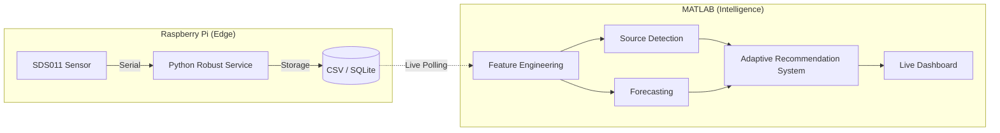

# Intelligent Air Quality System with Source Detection


An intelligent, rule-based Air Quality Monitoring system that goes beyond simple data logging. Built with **MATLAB** and deployed via **Raspberry Pi**, this system interfaces with a **Nova PM SDS011** sensor to provide real-time feature extraction, event detection, source classification, and adaptive recommendations.

## 🌟 Key Features

* **Real-time Data Acquisition:** Direct serial communication with the SDS011 PM sensor via a Raspberry Pi.
* **Machine Learning Classification:** Utilizes a trained Random Forest Ensemble model (`fitcensemble`) on a 7-dimensional feature vector to robustly classify pollution sources (e.g., Combustion, Dust Spikes).
* **Time-Series Forecasting:** Uses Holt-Winters Exponential Smoothing to predict $PM_{2.5}$ levels 15 steps into the future, enabling pre-emptive warnings before air quality breaches dangerous levels.
* **Advanced Feature Engineering:** Calculates rolling moving averages, volatility (std dev), skewness, and kurtosis on the fly.
* **Persistent Data Provenance:** Automatically logs raw data, ML features, forecasts, and classifications to a timestamped CSV file (`logs/`) at the end of every session.
* **Adaptive Recommendations:** Provides real-time actionable advice based on both current and forecasted severity.
* **Live Dashboard:** A real-time updating MATLAB GUI that visualizes concentrations and highlights detected events.
* **Simulation Mode:** Don't have the hardware? Run the system in mock mode to test the intelligence algorithms instantly!

## ⚙️ System Architecture



## 🛠️ Hardware Requirements

* Raspberry Pi (Any model with USB and Network capability)
* Nova PM SDS011 Sensor
* A PC running MATLAB with the **MATLAB Support Package for Raspberry Pi Hardware** installed.

## 🚀 Getting Started

### 1. Clone the repository
```bash
git clone https://github.com/yourusername/Intelligent-Air-Quality-System.git
cd Intelligent-Air-Quality-System
```

### 2. Configure Hardware Connection
Create a `.env` file in the project root (you can copy `.env.example`) and configure your Raspberry Pi credentials:
```env
PI_IP=xxx.xxx.x.xxx
PI_USER=yourusername
PI_PASS=yourpassword
SERIAL_PORT=/dev/ttyUSB0
```

### 3. Run the System
To run the system with your physical sensor, set `simulationMode = false;` in `main.m`, then run the script.

### No Hardware? Try Simulation Mode
If you want to review the source detection algorithms without the hardware, leave `simulationMode = true;` in `main.m`. This injects synthetic pollution events (dust, combustion, coarse particles) to demonstrate the classification tree.

## 🛡️ Phase 1: Making the System Robust
To ensure the system runs autonomously and survives crashes/reboots, we use a Python-based background service on the Raspberry Pi.

### 1. Deploy the Monitoring Script
Copy `scripts/air_quality_monitor.py` to your Raspberry Pi. This script is built to be "crash-proof" with internal error handling and automatic serial reconnection.

### 2. Setup Auto-start (systemd)
1. Copy `air_quality.service` to `/etc/systemd/system/air_quality.service` on the Pi:
   ```bash
   sudo cp air_quality.service /etc/systemd/system/air_quality.service
   ```
2. Edit the service file to match your user and paths:
   ```bash
   sudo nano /etc/systemd/system/air_quality.service
   ```
3. Enable and start the service:
   ```bash
   sudo systemctl daemon-reload
   sudo systemctl enable air_quality.service
   sudo systemctl start air_quality.service
   ```

### 3. Benefits
* **Auto-start:** The system starts collecting data as soon as the Pi boots.
* **Crash-proof:** If the script fails, systemd restarts it automatically. Internal `try/except` blocks handle sensor glitches.
* **SSH Independence:** The system runs in the background. You can disconnect your SSH session without stopping data collection.

## 📊 Phase 2: Fixing the Data Pipeline
The system now features a robust dual-storage architecture and intelligent data buffering.

### 1. Dual-Storage Architecture
Data is now stored in two formats simultaneously:
* **CSV (`logs/`):** Session-specific files preserved for easy import into MATLAB.
* **SQLite (`air_quality.db`):** A centralized, structured database for long-term reliability and complex querying.

### 2. Standardized Data Format
All records follow a strict schema:
| Column | Type | Description |
| :--- | :--- | :--- |
| `timestamp` | TEXT | ISO-style date and time (YYYY-MM-DD HH:MM:SS) |
| `pm25` | REAL | PM2.5 concentration in $\mu g/m^3$ |
| `pm10` | REAL | PM10 concentration in $\mu g/m^3$ |

### 3. Intelligent Data Buffering
To prevent "silent gaps" in your data if the sensor temporarily glitches:
* The script maintains a buffer of the **last valid reading**.
* If a read fails, the system logs the buffered value and records a warning in `error.log`.
* This ensures your time-series analysis remains continuous even during minor hardware hiccups.

## 🧠 Phase 3: Feature Engineering (Intelligence)
Once data is collected, we use MATLAB to transform raw sensor values into actionable intelligence.

### 1. Core Feature Extraction
The script `scripts/feature_engineering.m` processes the standardized CSV logs to calculate:
* **Moving Averages (`movmean`):** Smooths out high-frequency noise from the laser sensor.
* **Rate of Change (`diff`):** Measures the velocity of pollution influx, used to detect sudden events.
* **PM Ratio:** Calculates $PM_{2.5} / PM_{10}$, a critical signature for distinguishing between combustion (high ratio) and physical dust (low ratio).

### 2. Event Detection
The system implements a **Spike Detection** algorithm. By comparing the instantaneous rate of change against a defined threshold (e.g., $10 \mu g/m^3/s$), the system can automatically flag sudden disturbances for further investigation.

### 3. Usage
1. Open MATLAB.
2. Navigate to the `scripts/` folder.
3. Run `feature_engineering.m`.
4. The script will automatically load your latest log file and visualize the results.

## 🤖 Phase 4: Hybrid Source Detection
The system employs a hybrid intelligence model that combines human-explainable logic with machine learning.

### 1. Rule-Based Classification (Explainable AI)
We first apply a rule-based system to label the data. This provides a transparent "ground truth" based on known physical properties:
* **Traffic:** High $PM_{2.5}$ with relatively low $PM_{10}$.
* **Dust:** Very high $PM_{10}$ levels.
* **Local Event:** Triggered by sudden spikes in $PM_{2.5}$.
* **Normal:** Baseline air quality.

### 2. Random Forest Integration (Advanced ML)
Using the `scripts/source_detection_ml.m` script, the system trains a **Random Forest Classifier (`TreeBagger`)** on a 6-dimensional feature vector.
* **Algorithm:** An ensemble of 50 decision trees.
* **Features:** `pm25`, `pm10`, `pm25_avg`, `pm10_avg`, `pm25_diff`, `ratio`.
* **Output:** A robust `.mat` model that can be used for real-time classification in future sessions.

### 3. Usage
1. Open `scripts/source_detection_ml.m` in MATLAB.
2. Run the script to train the model on your collected data.
3. The script will output the **Out-of-Bag (OOB) Error** and visualize which features (like the Ratio) were most important for detection.

## 🔮 Phase 5: Time Series Forecasting
The system includes a predictive module to move from reactive monitoring to pre-emptive warnings.
* **Forecasting Model:** Uses a Linear Regression model (`fitlm`) to predict future values based on current concentrations.
* **Pre-emptive Warnings:** If the forecasted value exceeds healthy thresholds (e.g., $60 \mu g/m^3$), the system issues a warning *before* the air quality actually worsens.

## ✅ Phase 6: Adaptive Recommendation System
The final layer of the system is the **Adaptive Intelligence Engine** implemented in `scripts/adaptive_intelligence_system.m`.

### 1. Decision Logic
The system evaluates four distinct inputs to generate real-time recommendations:
1. **Current Values:** Is the air healthy right now?
2. **Trend (Velocity):** Is the pollution rising rapidly?
3. **Forecasts:** What is the air quality expected to be in the next sample?
4. **Detected Source:** Is the pollution from traffic, dust, or a local event?

### 2. Adaptive Output
| Scenario | Recommendation |
| :--- | :--- |
| PM2.5 > 50 | **DANGER:** Wear mask & activate purifier |
| Rapid Increase or Forecasted Spike | **PRE-EMPTIVE:** Close windows - quality worsening |
| Dust Source Detected | **CAUTION:** Outdoor dust detected - avoid exercise |
| Normal Baseline | Air is acceptable |

### 3. Usage
Run `scripts/adaptive_intelligence_system.m` in MATLAB to generate the **Master Dashboard**, which visualizes the entire end-to-end intelligence pipeline.

## 🔗 Phase 7: High-Performance Socket Integration
The system now features a professional-grade telemetry link using direct **TCP Sockets** for zero-latency intelligence.

### 1. High-Performance Telemetry
Instead of polling slow CSV files, the Raspberry Pi now acts as a **TCP Client** that pushes JSON data packets directly to MATLAB as soon as they are read from the sensor.
* **Benefit:** Eliminates 5-second polling delay and disk I/O overhead.
* **Port:** 5005 (Configurable in `scripts/air_quality_monitor.py`).

### 2. Zero-Latency Dashboard
Use `scripts/socket_intelligence_dashboard.m` to start a high-performance TCP Server in MATLAB. This dashboard provides near-instantaneous visualization and classification.

---

## 🧠 Advanced Data Science & Robustness
The system has been hardened against common data science pitfalls:

### 1. Statistical Rigor (No Data Leakage)
The training pipeline (`scripts/train_offline_model.m`) now uses a **Chronological Split** (first 80% for training, last 20% for testing). This respects the temporal dependencies of air quality data and ensures that reported accuracy is realistic for real-world deployment.

### 2. Recursive Stability (Dampened Forecasting)
The Holt-Winters forecasting algorithm now includes a **Trend Dampening Factor ($\phi = 0.98$)**. This prevents "state drift" where extreme short-term events could permanently skew the long-term trend, ensuring the system remains stable over months of continuous operation.

### 3. Dynamic Intelligence (Environment-Adaptive Heuristics)
Static thresholds are gone. The system's fallback logic now **dynamically scales** based on the environmental baseline:
* It calculates the **Median** and **Median Absolute Deviation (MAD)** of your specific deployment area.
* Events are flagged when they deviate significantly from *your* local baseline, rather than using arbitrary numbers.

---

## 🔬 FSDA Integration (Robust Statistics)
This project is integrated with the **Flexible Statistics and Data Analysis (FSDA)** toolbox for MATLAB, which is widely used in academic research.
After the real-time monitoring session completes, the system automatically triggers a robust post-analysis phase using the `FSM` (Forward Search for Multivariate Outliers) algorithm. 
This allows the system to discover masked pollution anomalies in the joint $[PM_{2.5}, PM_{10}]$ feature space that traditional `mean + std` thresholds might miss.

---

## 🧪 Testing & Automation

To ensure the reliability of this high-stakes environmental monitoring system, we have implemented a comprehensive dual-language testing suite with automated CI/CD.

### 1. Python Edge Testing (Pytest)
Located in `tests/test_air_quality_monitor.py`. This suite validates the critical data acquisition path:
* **SDS011 Parsing:** Verified against known-good byte frames.
* **SQLite Persistence:** Confirms data is correctly committed to the local database.
* **Buffering Robustness:** Simulates sensor read failures to verify the "Hold-Last-Valid" logic.
* **Performance Benchmarking:** Ensures frame parsing remains optimized for real-time telemetry.

### 2. MATLAB Intelligence Testing (Unit Test Framework)
Located in `tests/AirQualitySystemTest.m`. This suite verifies the core data science logic:
* **Feature Accuracy:** Confirms Z-score normalization and 7D vector extraction are numerically correct.
* **Forecasting Stability:** Validates that the Trend Dampening factor successfully prevents recursive state drift.
* **Dynamic Logic:** Tests that classification source detection scales correctly relative to the local environment's MAD baseline.

### 3. CI/CD Pipeline & Coverage (GitHub Actions + Codecov)
Every commit to the repository triggers an automated pipeline defined in `.github/workflows/ci.yml`:
* **Automated Regression:** Prevents breaking changes from being merged.
* **Code Coverage:** The pipeline generates coverage reports for both Python (`pytest-cov`) and MATLAB (`Cobertura`).
* **Codecov Integration:** Results are automatically uploaded to Codecov, ensuring that new features maintain high test density across both the edge service and the intelligence hub.

---
*Created as an advanced implementation of sensor data processing and intelligent decision making.*
