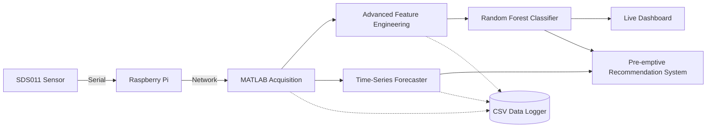

# Intelligent Air Quality System with Source Detection


An intelligent, rule-based Air Quality Monitoring system that goes beyond simple data logging. Built with **MATLAB** and deployed via **Raspberry Pi**, this system interfaces with a **Nova PM SDS011** sensor to provide real-time feature extraction, event detection, source classification, and adaptive recommendations.

## 🌟 Key Features

* **Real-time Data Acquisition:** Direct serial communication with the SDS011 PM sensor via a Raspberry Pi.
* **Machine Learning Classification:** Utilizes a trained Random Forest Ensemble model (`fitcensemble`) on a 7-dimensional feature vector to robustly classify pollution sources (e.g., Combustion, Dust Spikes).
* **Time-Series Forecasting:** Uses Holt-Winters Exponential Smoothing to predict $PM_{2.5}$ levels 15 steps into the future, enabling pre-emptive warnings before air quality breaches dangerous levels.
* **Advanced Feature Engineering:** Calculates rolling moving averages, volatility (std dev), skewness, and kurtosis on the fly.
* **Persistent Data Provenance:** Automatically logs raw data, ML features, forecasts, and classifications to a timestamped CSV file (`logs/`) at the end of every session.
* **Adaptive Recommendations:** Provides real-time actionable advice based on both current and forecasted severity.
* **Live Dashboard:** A real-time updating MATLAB GUI that visualizes concentrations and highlights detected events.
* **Simulation Mode:** Don't have the hardware? Run the system in mock mode to test the intelligence algorithms instantly!

## ⚙️ System Architecture



## 🛠️ Hardware Requirements

* Raspberry Pi (Any model with USB and Network capability)
* Nova PM SDS011 Sensor
* A PC running MATLAB with the **MATLAB Support Package for Raspberry Pi Hardware** installed.

## 🚀 Getting Started

### 1. Clone the repository
```bash
git clone https://github.com/yourusername/Intelligent-Air-Quality-System.git
cd Intelligent-Air-Quality-System
```

### 2. Configure Hardware Connection
Create a `.env` file in the project root (you can copy `.env.example`) and configure your Raspberry Pi credentials:
```env
PI_IP=xxx.xxx.x.xxx
PI_USER=yourusername
PI_PASS=yourpassword
SERIAL_PORT=/dev/ttyUSB0
```

### 3. Run the System
To run the system with your physical sensor, set `simulationMode = false;` in `main.m`, then run the script.

### No Hardware? Try Simulation Mode
If you want to review the source detection algorithms without the hardware, leave `simulationMode = true;` in `main.m`. This injects synthetic pollution events (dust, combustion, coarse particles) to demonstrate the classification tree.

## 🛡️ Phase 1: Making the System Robust
To ensure the system runs autonomously and survives crashes/reboots, we use a Python-based background service on the Raspberry Pi.

### 1. Deploy the Monitoring Script
Copy `scripts/air_quality_monitor.py` to your Raspberry Pi. This script is built to be "crash-proof" with internal error handling and automatic serial reconnection.

### 2. Setup Auto-start (systemd)
1. Copy `air_quality.service` to `/etc/systemd/system/air_quality.service` on the Pi:
   ```bash
   sudo cp air_quality.service /etc/systemd/system/air_quality.service
   ```
2. Edit the service file to match your user and paths:
   ```bash
   sudo nano /etc/systemd/system/air_quality.service
   ```
3. Enable and start the service:
   ```bash
   sudo systemctl daemon-reload
   sudo systemctl enable air_quality.service
   sudo systemctl start air_quality.service
   ```

### 3. Benefits
* **Auto-start:** The system starts collecting data as soon as the Pi boots.
* **Crash-proof:** If the script fails, systemd restarts it automatically. Internal `try/except` blocks handle sensor glitches.
* **SSH Independence:** The system runs in the background. You can disconnect your SSH session without stopping data collection.

## 📊 Phase 2: Fixing the Data Pipeline
The system now features a robust dual-storage architecture and intelligent data buffering.

### 1. Dual-Storage Architecture
Data is now stored in two formats simultaneously:
* **CSV (`logs/`):** Session-specific files preserved for easy import into MATLAB.
* **SQLite (`air_quality.db`):** A centralized, structured database for long-term reliability and complex querying.

### 2. Standardized Data Format
All records follow a strict schema:
| Column | Type | Description |
| :--- | :--- | :--- |
| `timestamp` | TEXT | ISO-style date and time (YYYY-MM-DD HH:MM:SS) |
| `pm25` | REAL | PM2.5 concentration in $\mu g/m^3$ |
| `pm10` | REAL | PM10 concentration in $\mu g/m^3$ |

### 3. Intelligent Data Buffering
To prevent "silent gaps" in your data if the sensor temporarily glitches:
* The script maintains a buffer of the **last valid reading**.
* If a read fails, the system logs the buffered value and records a warning in `error.log`.
* This ensures your time-series analysis remains continuous even during minor hardware hiccups.

## 🧠 The Intelligence & Data Science Module

The core of the system resides in `src/AirQualitySystem.m` and represents a Master's level data science pipeline:

### Offline Training & Evaluation
To ensure zero-latency startup and rigorous validation, the system uses an offline training pipeline (`scripts/train_offline_model.m`).
* **Evaluation Metrics:** The model is validated using **Confusion Matrices, Precision, Recall, and F1-Scores** on a 20% unseen test set before deployment.
* **Feature Scaling:** The system applies **Z-score normalization** ($Z = \frac{x - \mu}{\sigma}$) to the feature vector using parameters derived from the training distribution, ensuring algorithm interchangeability and statistical consistency.

### Machine Learning Classification
The system extracts a **7-Dimensional Feature Vector** (Ratio, Rate of Change, Moving Averages, Volatility, Skewness, Kurtosis) and feeds it into a pre-trained **Random Forest Classifier** to determine the source of the pollution (e.g., Cooking Smoke vs. Outdoor Dust). If the trained model is missing, it gracefully falls back to rule-based heuristics.

### Predictive Time-Series Forecasting
Instead of just reacting to bad air, the system uses a **Recursive Holt-Winters Exponential Smoothing** algorithm ($O(1)$ complexity) to look into the future. By maintaining state variables (Level and Trend) and updating them incrementally, the system achieves significant computational efficiency over sliding-window methods. If the air is clean now but forecasted to spike in 15 minutes, the system issues a **Pre-emptive Warning**.

### Data Provenance
Data is logged persistently. At the end of every session, the system automatically writes all raw sensor data, extracted normalized features, ML predictions, and forecasts to a timestamped `.csv` file in the `logs/` directory.

### 🔬 FSDA Integration (Robust Statistics)
This project is integrated with the **Flexible Statistics and Data Analysis (FSDA)** toolbox for MATLAB, which is widely used in academic research.
After the real-time monitoring session completes, the system automatically triggers a robust post-analysis phase using the `FSM` (Forward Search for Multivariate Outliers) algorithm. 
This allows the system to discover masked pollution anomalies in the joint $[PM_{2.5}, PM_{10}]$ feature space that traditional `mean + std` thresholds might miss.

---
*Created as an advanced implementation of sensor data processing and intelligent decision making.*
