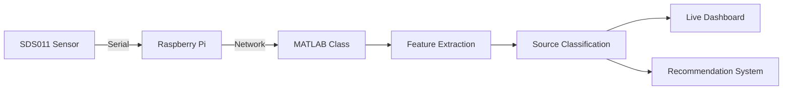

# Intelligent Air Quality System with Source Detection


An intelligent, rule-based Air Quality Monitoring system that goes beyond simple data logging. Built with **MATLAB** and deployed via **Raspberry Pi**, this system interfaces with a **Nova PM SDS011** sensor to provide real-time feature extraction, event detection, source classification, and adaptive recommendations.

## 🌟 Key Features

* **Real-time Data Acquisition:** Direct serial communication with the SDS011 PM sensor via a Raspberry Pi.
* **Intelligent Source Classification:** Analyzes the rate of change and $PM_{2.5} / PM_{10}$ ratio to classify pollution sources (e.g., Cooking/Combustion vs. Outdoor Dust).
* **Dynamic Event Detection:** Uses statistical baselines (mean + 2*std) instead of hardcoded thresholds.
* **Adaptive Recommendations:** Provides real-time actionable advice based on severity.
* **Live Dashboard:** A real-time updating MATLAB GUI that visualizes concentrations and highlights detected events on the fly.
* **Simulation Mode:** Don't have the hardware? Run the system in mock mode to test the intelligence algorithms instantly!

## ⚙️ System Architecture



## 🛠️ Hardware Requirements

* Raspberry Pi (Any model with USB and Network capability)
* Nova PM SDS011 Sensor
* A PC running MATLAB with the **MATLAB Support Package for Raspberry Pi Hardware** installed.

## 🚀 Getting Started

### 1. Clone the repository
```bash
git clone https://github.com/yourusername/Intelligent-Air-Quality-System.git
cd Intelligent-Air-Quality-System
```

### 2. Configure Hardware Connection
Open `main.m` in MATLAB and configure your Raspberry Pi credentials:
```matlab
pi_ip = 'xx.xx.xx.xxx';
pi_user = 'pi';
pi_pass = 'xxxx';
serial_port = '/dev/ttyUSB0';
```

### 3. Run the System
To run the system with your physical sensor, set `simulationMode = false;` in `main.m`, then run the script.

### No Hardware? Try Simulation Mode
If you want to review the source detection algorithms without the hardware, leave `simulationMode = true;` in `main.m`. This injects synthetic pollution events (dust, combustion, coarse particles) to demonstrate the classification tree.

## 🧠 The Intelligence Module

The core of the system resides in `src/AirQualitySystem.m` inside the `analyze()` method.

* **Combustion / Smoke:** Characterized by a high $PM_{2.5}$ to $PM_{10}$ ratio (> 0.8).
* **Coarse Particles (Dust):** Characterized by a low ratio (< 0.5).
* **Sudden Disturbances:** Detected via high rate-of-change (differential) calculus.

---
*Created as an advanced implementation of sensor data processing and intelligent decision making.*
