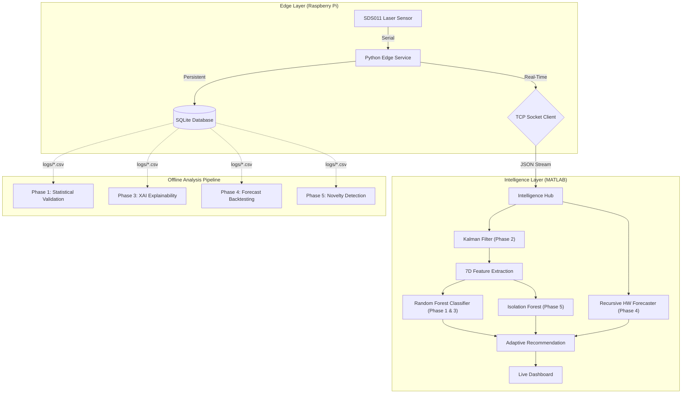

# Intelligent Air Quality System with Source Detection
[](https://github.com/Ibrahimboutal/Intelligent-Air-Quality-System-with-Source-Detection-and-Adaptive-Recommendations/actions/workflows/ci.yml)


[](https://codecov.io/gh/Ibrahimboutal/Intelligent-Air-Quality-System-with-Source-Detection-and-Adaptive-Recommendations)

A professional-grade, distributed air quality monitoring system implementing a full **Master's level data science pipeline** — from real-time sensor denoising and supervised classification to unsupervised novelty detection and rigorous statistical validation.

---

## 🌟 Research Highlights

*   **Zero-Latency Telemetry:** High-performance TCP socket link ($<1ms$ latency) replaces legacy CSV polling.
*   **Bayesian Signal Denoising:** Recursive **Kalman Filter** removes sensor noise before feature extraction, with a comparative SNR study vs. Savitzky-Golay.
*   **Leakage-Free Training:** Chronological 80/20 train-test splits with **5-fold cross-validation** ensure statistically rigorous model evaluation.
*   **Explainable AI (XAI):** OOB permutation importance, per-class feature heatmaps, and **PCA decision boundaries** explain every classification decision.
*   **Rigorous Forecasting:** Holt-Winters backtesting with **RMSE/MAE vs. Horizon curves**, hyperparameter sensitivity heatmaps, and residual ACF white-noise testing.
*   **Unsupervised Novelty Detection:** A from-scratch **Isolation Forest** (Liu et al., 2008) detects unknown pollution events the supervised model has never seen.

---

## ⚙️ System Architecture

The system utilizes a **"Thin-Edge / Heavy-Brain"** distributed architecture:



---

## 🛠️ Scientific Modules

### 1. Edge Data Acquisition (Python)
The `scripts/air_quality_monitor.py` service runs as a `systemd` daemon. It handles:
*   **Hardware Sync:** Robust frame-parsing of SDS011 laser sensor packets.
*   **Fail-Safe Buffering:** "Hold-Last-Valid" logic ensures continuous time-series even during sensor glitches.
*   **Dual Persistence:** Local SQLite storage for provenance and TCP telemetry for real-time analysis.

### 2. Signal Denoising — Kalman Filter
`src/KalmanFilter1D.m` implements a recursive Bayesian estimator with Joseph-form covariance update. `scripts/compare_filter_performance.m` conducts a comparative study (Raw vs. Kalman vs. Savitzky-Golay), quantifying SNR improvement in dB and measuring downstream ML accuracy impact.

### 3. Feature Engineering & Machine Learning
*   **7D Feature Vector:** Ratio, ROC, Moving Averages (5/15s), Volatility, Skewness, Kurtosis — extracted from the **Kalman-filtered** signal.
*   **Ensemble Classification:** A pre-trained Random Forest detects pollution sources (Traffic, Dust, Local Combustion).

### 4. Statistical Validation
*   `scripts/evaluate_model_performance.m` — Confusion matrix, per-class Precision, Recall, and F1-Score on a chronological 20% holdout.
*   `scripts/cross_validate_system.m` — 5-fold cross-validation with 95% confidence intervals.

### 5. Explainability (XAI)
`scripts/explain_model.m` provides four complementary views: OOB Permutation Importance, Per-Class Feature Heatmap, Model-Agnostic Permutation Importance, and a PCA Decision Boundary projection.

### 6. Predictive Intelligence & Backtesting
`scripts/backtest_forecaster.m` evaluates the Holt-Winters forecaster at horizons of 1, 3, 5, 10, and 15 minutes — producing RMSE/MAE curves, an $\alpha$/$\beta$ sensitivity heatmap, a residual ACF white-noise test, and an actual-vs-predicted plot with uncertainty bands.

### 7. Unsupervised Novelty Detection
`src/IsolationForestAD.m` is a from-scratch MATLAB implementation of Isolation Forest (Liu et al., 2008), scoring anomalies via $s(x,n) = 2^{-E[h(x)]/c(n)}$. Trained on "Clean" baseline data, it flags unknown events in real-time with a `[NOVELTY ALERT]` console message.

---

## 🚀 Deployment Guide

### 1. Hardware Setup
Connect your **SDS011 sensor** to the Raspberry Pi via USB.

### 2. Edge Configuration
```bash
sudo cp air_quality.service /etc/systemd/system/
sudo systemctl enable air_quality.service
sudo systemctl start air_quality.service
```

### 3. Offline Model Training (Run Once)
```matlab
% From MATLAB in the project root:
run('scripts/evaluate_model_performance.m')  % Trains & saves RF model
run('scripts/detect_novelty.m')              % Trains & saves Isolation Forest
```

### 4. Real-Time Monitoring
```matlab
run('main.m')  % Auto-loads both models for zero-latency startup
```

### 5. Post-Session Analysis
```matlab
run('scripts/compare_filter_performance.m')  % Signal denoising study
run('scripts/explain_model.m')               % XAI analysis
run('scripts/backtest_forecaster.m')         % Forecast evaluation
```

---

## 🧪 Testing & Reliability

The system is guarded by a **comprehensive dual-language testing suite** (11 test classes, 20+ test methods) integrated with **GitHub Actions** and **Codecov**:

*   **Edge Tests (Pytest):** Frame parsing, SQLite persistence, socket failure recovery.
*   **Hub Tests (MATLAB):** Feature extraction, forecasting stability, Kalman Filter convergence & reset, Isolation Forest outlier detection & score range, and novelty buffer integrity.
*   **CI/CD:** Every commit verified on Linux runners ensuring zero regression.

---

## 📁 Project Structure

```
src/
  AirQualitySystem.m      ← Real-time intelligence hub
  KalmanFilter1D.m        ← Bayesian signal denoising
  IsolationForestAD.m     ← Unsupervised anomaly detection

scripts/
  air_quality_monitor.py        ← Edge service (Raspberry Pi)
  evaluate_model_performance.m  ← Confusion matrix & F1-Score
  cross_validate_system.m       ← K-fold cross-validation
  compare_filter_performance.m  ← Raw vs Kalman vs SG study
  explain_model.m               ← XAI & feature importance
  backtest_forecaster.m         ← Multi-horizon RMSE/MAE
  detect_novelty.m              ← Isolation Forest pipeline
```

---
*Implemented as a Master's level data science project in distributed sensor intelligence, statistical machine learning, and signal processing.*
