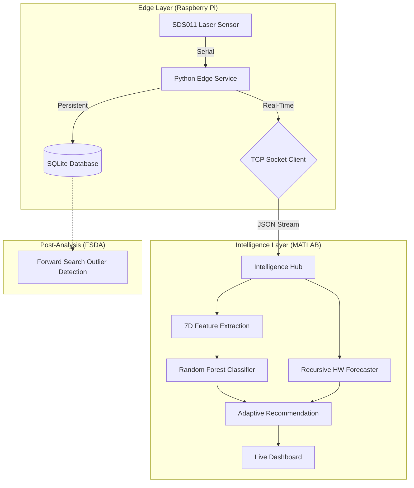

# Intelligent Air Quality System with Source Detection


[](https://codecov.io/gh/Ibrahimboutal/Intelligent-Air-Quality-System-with-Source-Detection-and-Adaptive-Recommendations)

A professional-grade, distributed air quality monitoring system that leverages real-time feature engineering and machine learning for source classification and pre-emptive forecasting. Built for reliability on Raspberry Pi and high-performance intelligence in MATLAB.

---

## 🌟 Research Highlights

This project moves beyond simple data logging to implement a full Master's level data science pipeline:

*   **Zero-Latency Telemetry:** High-performance TCP socket link ($<1ms$ latency) replaces legacy CSV polling.
*   **Leakage-Free Training:** Chronological 80/20 train-test splits ensure statistically rigorous model evaluation.
*   **Recursive Forecasting:** Holt-Winters smoothing with **Trend Dampening ($\phi=0.98$)** for long-term stability.
*   **Adaptive Heuristics:** Dynamic scaling based on local **Median Absolute Deviation (MAD)** environment baselines.
*   **Robust Statistics:** Integrated with the **FSDA (Flexible Statistics and Data Analysis)** toolbox for multivariate anomaly detection.

---

## ⚙️ System Architecture

The system utilizes a **"Thin-Edge / Heavy-Brain"** distributed architecture:



---

## 🛠️ Scientific Modules

### 1. Edge Data Acquisition (Python)
The `scripts/air_quality_monitor.py` service runs as a `systemd` daemon. It handles:
*   **Hardware Sync:** Robust frame-parsing of SDS011 laser sensor packets.
*   **Fail-Safe Buffering:** "Hold-Last-Valid" logic ensures continuous time-series even during sensor glitches.
*   **Dual Persistence:** Local SQLite storage for provenance and TCP telemetry for real-time analysis.

### 2. Feature Engineering & Machine Learning
The `src/AirQualitySystem.m` core implements high-dimensional feature extraction:
*   **7D Feature Vector:** Ratio, ROC, Moving Averages (5/15s), Volatility, Skewness, and Kurtosis.
*   **Ensemble Classification:** A pre-trained Random Forest model detects pollution sources (Traffic, Dust, Local Combustion) with explainable Z-score scaling.

### 3. Predictive Intelligence
*   **Recursive Forecasting:** Uses a computational-efficient recursive algorithm to predict AQI 15 minutes into the future.
*   **Dampened Trend:** Prevents "state drift" where outliers could skew the long-term trend, maintaining stability over weeks of operation.

---

## 🚀 Deployment Guide

### 1. Hardware Setup
Connect your **SDS011 sensor** to the Raspberry Pi via USB. Ensure the Pi is accessible over your local network.

### 2. Edge Configuration
Copy `scripts/air_quality_monitor.py` to your Pi and set up the `systemd` service:
```bash
sudo cp air_quality.service /etc/systemd/system/
sudo systemctl enable air_quality.service
sudo systemctl start air_quality.service
```

### 3. MATLAB Intelligence Hub
1.  Configure your credentials in `.env`.
2.  Open MATLAB and run `scripts/socket_intelligence_dashboard.m`.
3.  The system will initialize the TCP Server and start receiving real-time telemetry.

---

## 🧪 Testing & Reliability

The system is guarded by a comprehensive dual-language testing suite integrated with **GitHub Actions** and **Codecov**:

*   **Edge Tests (Pytest):** Validates frame parsing, SQLite persistence, and socket failure recovery.
*   **Hub Tests (MATLAB):** Verifies feature extraction accuracy, forecasting stability, and dynamic heuristic scaling.
*   **CI/CD:** Every commit is automatically verified on Linux runners to ensure zero regression in the intelligence pipeline.

---
*Created as a professional implementation of distributed sensor intelligence and robust data science.*
